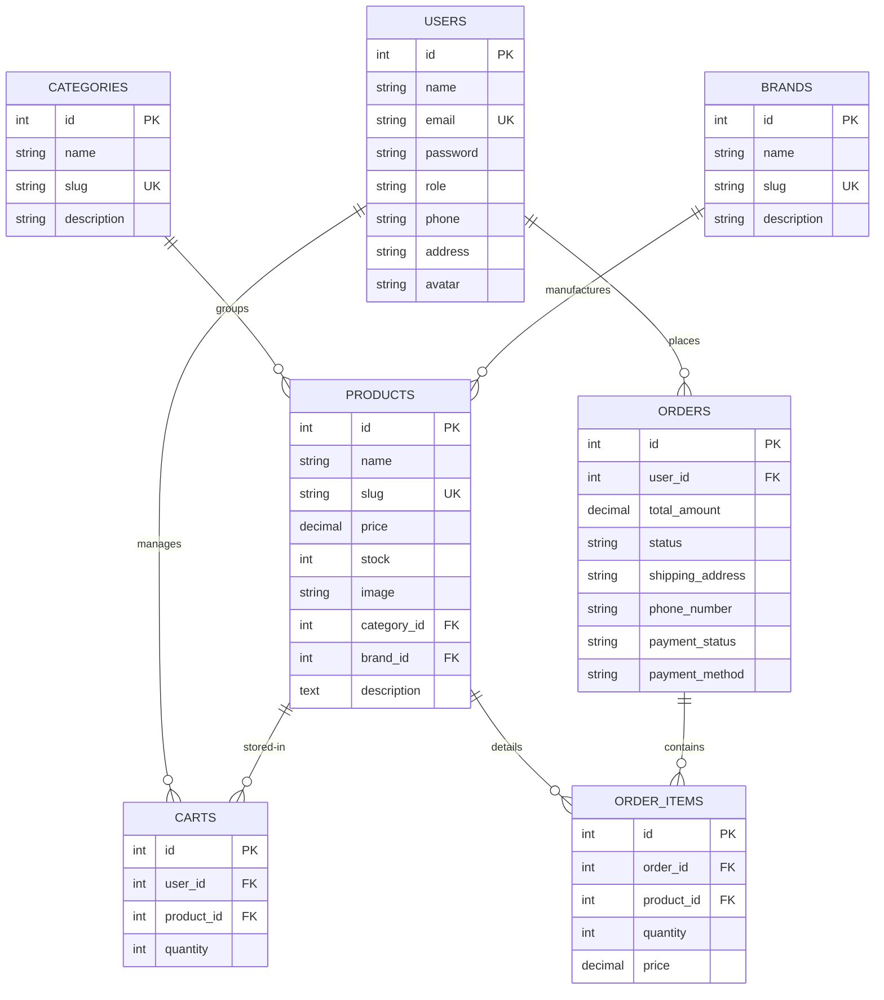
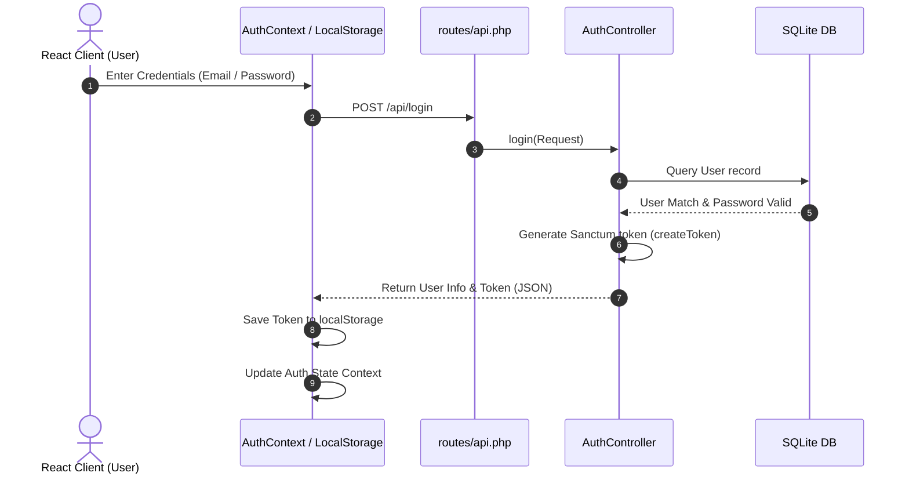
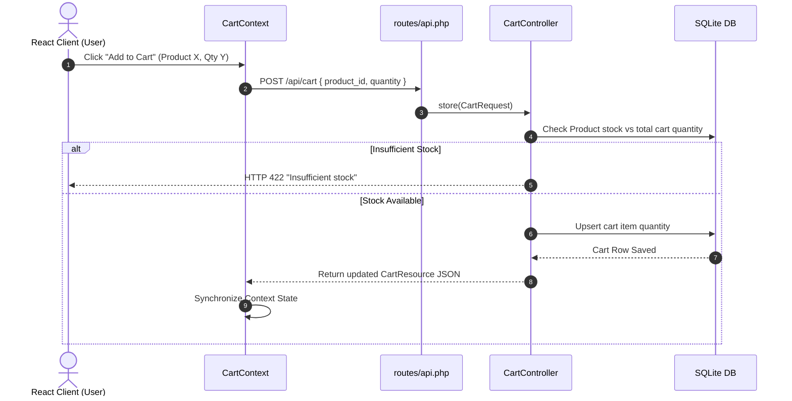
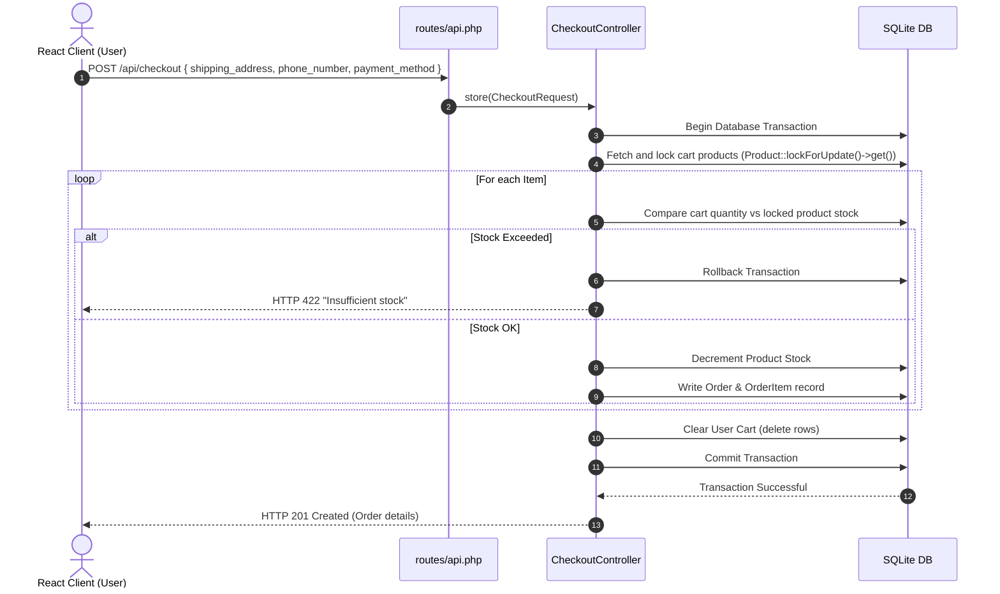
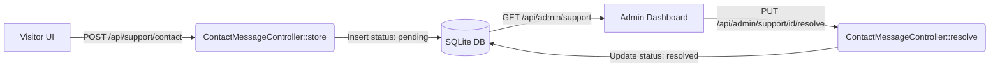

# Technical Specification & Data Flow Guide

This document describes the technical architecture, database design, and end-to-end data flows for the **Voltaire / Tech E-commerce Platform**. It is intended as a reference for developers, engineers, and architects onboarding to the codebase.

---

## 1. System Architecture

Voltaire / Tech operates under a decoupled, headless client-server architecture:

```mermaid
graph TD
    subgraph Client-Side (React SPA)
        React[React 19 View Components]
        Context[Auth & Cart Contexts]
        AxiosClient[apiClient.ts / Fetch]
        React --> Context
        Context --> AxiosClient
    end

    subgraph Server-Side (Laravel API)
        Router[routes/api.php]
        Middleware[Sanctum & Admin Middleware]
        Controllers[API Controllers]
        Eloquent[Eloquent ORM Models]
        Router --> Middleware
        Middleware --> Controllers
        Controllers --> Eloquent
    end

    subgraph Infrastructure
        DB[(SQLite database.sqlite)]
        Cloudinary[Cloudinary API]
        Eloquent --> DB
        Controllers --> Cloudinary
    end

    AxiosClient <-->|JSON over HTTP / Bearer Auth| Router
```

### 1.1 Technology Summary
- **Frontend SPA**: React 19 + TypeScript + Vite 8.
- **Backend API**: Laravel 13.x + PHP 8.3.
- **Database**: SQLite, featuring active row-locking (`lockForUpdate`) for inventory control.
- **Media Hosting**: Cloudinary, facilitating instant uploads for admin product image fields.
- **Production Server**: Dockerized Apache container running on Render with SQLite database volume storage.

---

## 2. Database Design & Relationships

The database is built on normalized SQLite tables linked via Eloquent relationships:



---

## 3. End-to-End Data Flows

### 3.1 Authentication & Session Management
All authenticated operations use Laravel Sanctum API tokens.



* **Token Attachment**: The frontend [apiClient.ts](file:///D:/Website%20Ecomerce%20online/frontend/src/apiClient.ts) intercepts outgoing requests and appends the token:
  ```typescript
  const token = localStorage.getItem('token');
  const headers = {
      'Accept': 'application/json',
      ...(token && { Authorization: `Bearer ${token}` }),
  };
  ```

---

### 3.2 Shopping Cart Operations
The shopping cart flow updates local React context state while syncing directly to the SQLite backend.



---

### 3.3 Checkout & Order Processing (Transaction Flow)
To prevent race conditions where multiple users buy the last item simultaneously, the checkout controller employs database transactions combined with SQLite row locking (`lockForUpdate`).



#### Code Snippet - Row Locking:
Found in [`app/Http/Controllers/CheckoutController.php`](file:///D:/Website%20Ecomerce%20online/app/Http/Controllers/CheckoutController.php#L27-L68):
```php
$order = DB::transaction(function () use ($user, $cartItems, $request, $paymentStatus) {
    $productIds = $cartItems->pluck('product_id');
    // Lock rows to prevent double-spending stock
    $products = Product::lockForUpdate()->whereIn('id', $productIds)->get()->keyBy('id');

    $total = 0;
    foreach ($cartItems as $cartItem) {
        $product = $products->get($cartItem->product_id);
        if ($cartItem->quantity > $product->stock) {
            throw new \RuntimeException("Insufficient stock.");
        }
        $total += $product->price * $cartItem->quantity;
    }
    // ... creates order & decrements stock ...
});
```

---

### 3.4 Support & Ticketing Flow
Visitors can submit support messages, which are indexed and managed via the Admin Support Panel.



---

## 4. Environment Configuration (`.env`)

For a successful setup, ensure the following core variables are configured:

| Key | Purpose | Suggested Value (Local) |
|---|---|---|
| `APP_ENV` | Application environment | `local` |
| `DB_CONNECTION` | Database type | `sqlite` |
| `DB_DATABASE` | SQLite path | `D:\Website Ecomerce online\database\database.sqlite` |
| `CLOUDINARY_URL` | Image Storage Key | `cloudinary://<API_KEY>:<API_SECRET>@<CLOUD_NAME>` |
| `VITE_API_URL` | React API Target | `http://127.0.0.1:8000/api` |
